# Remote Access and Filesystem
>Step 1: Installing VScode

I skipped this step because my computer already has VScode installed when I was taking the CSE 11 before this class.

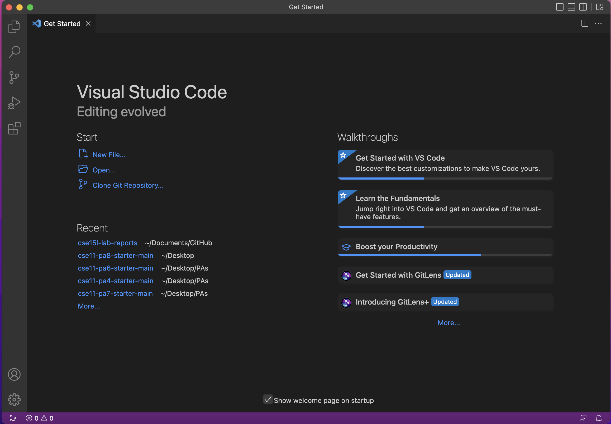

>Step 2: Remotely Connecting
* Remotely connect to the CSE department computer using terminal in VS code.
* Use the ssh command to access the remote computer and enter the password to login successfully. 

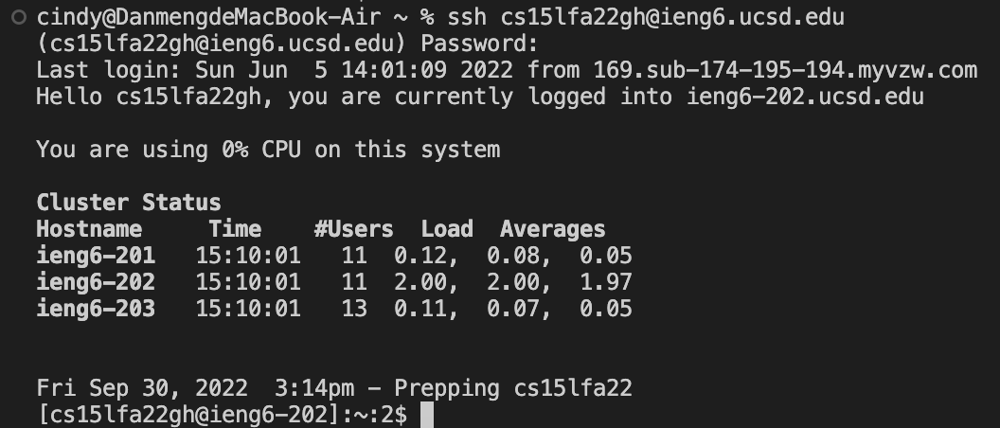

>Step 3: Run some commands
* Running the Is, cd, cat, and cp commands in different ways on the local computer.

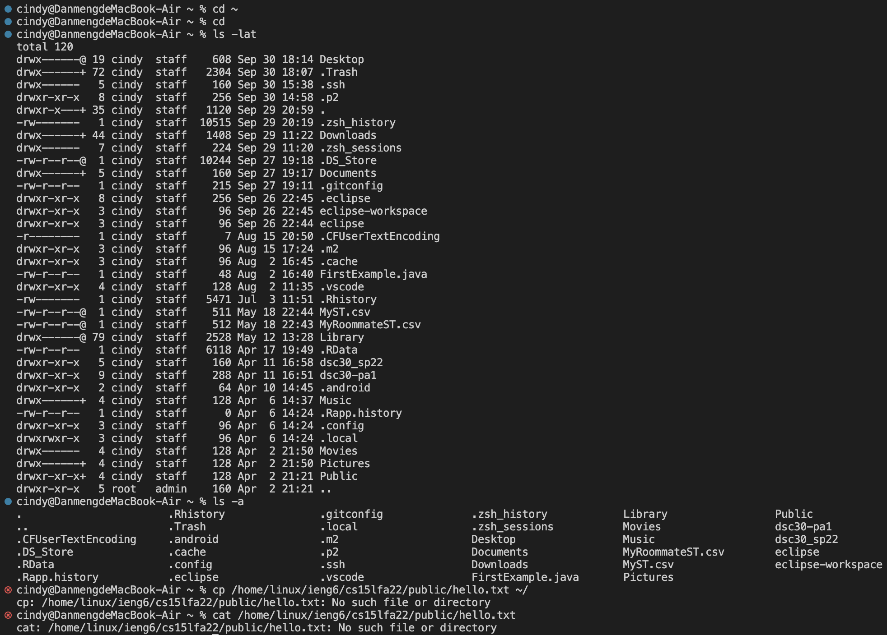

* Running the Is, cd, cat, and cp commands in different ways on the remote computer.

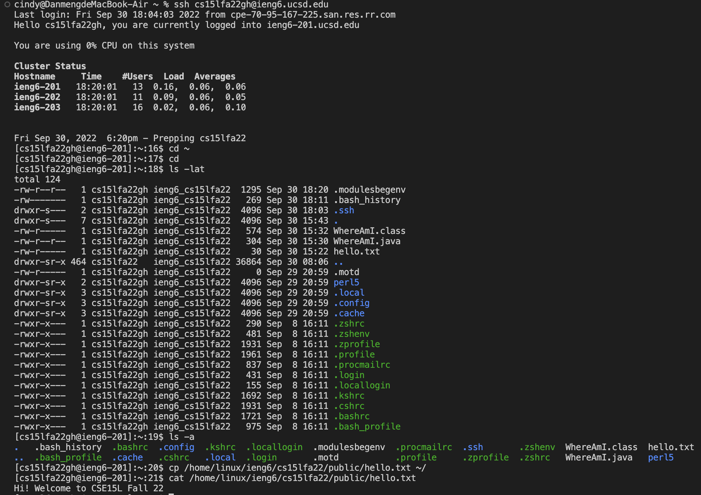

>Step 4: Moving files
* Create a file called WhereAmI on the local computer. Compile and run the file in the terminal.

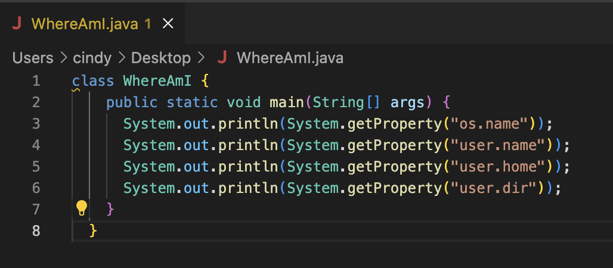
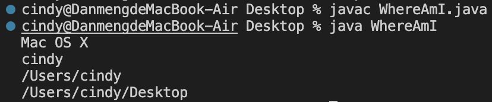

* Copy the file from local computer to remote computer using scp command. Login to the remote computer to access the file in the home directory.
* Compile and run the file on the remote computer.

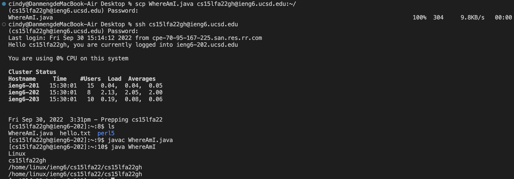

>Step 5: SSH keys
* Generate SSH keys using the terminal and save the key in the default path.

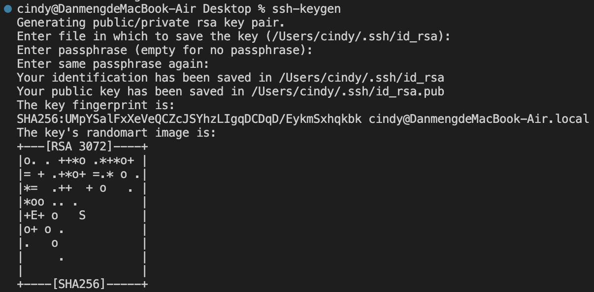

*Login to the remote computer and create ssh directory on it.

*Copy the public key to the remote computer ssh directory using scp and successfully login without entering the password.

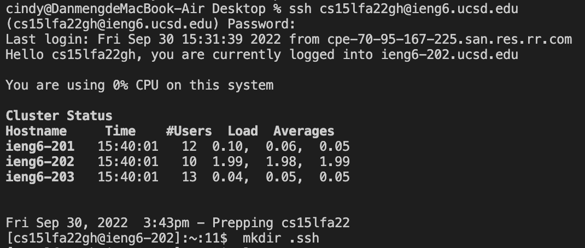

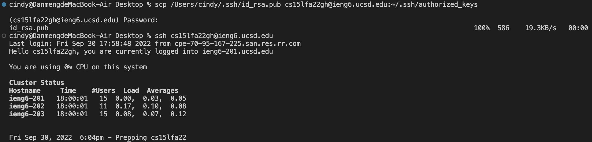

>Step 6: Optimizing Remote Running
* Delete the last line of code to make change to the file.
* Compile and run the file and copy to the remote server using scp.
* Login remote server from ssh and compile and run the file.

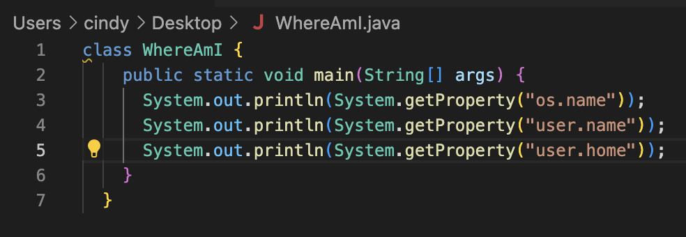

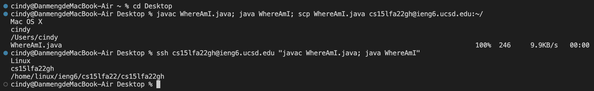

