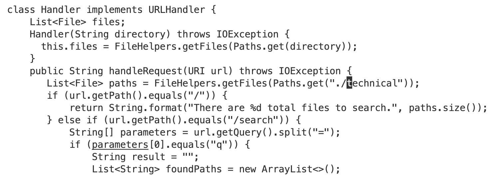
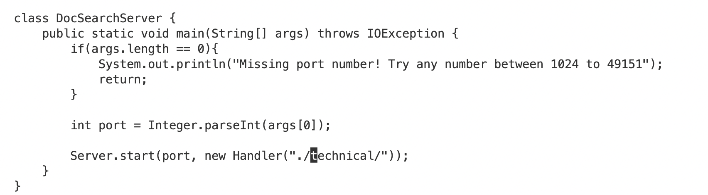
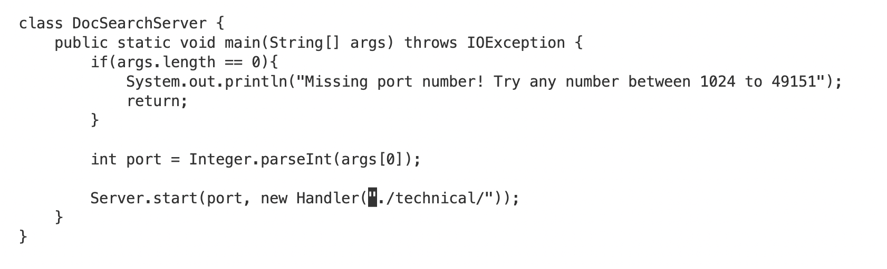
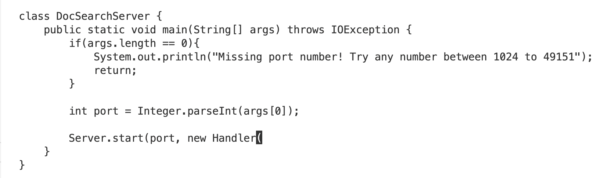
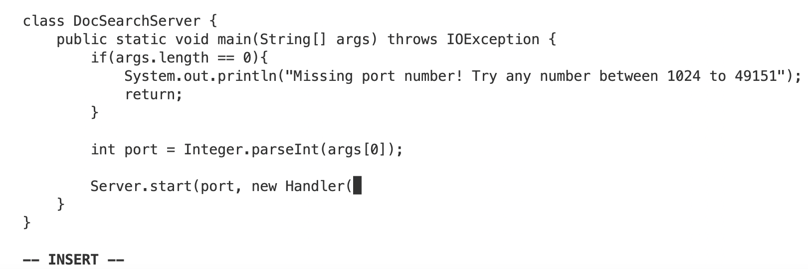
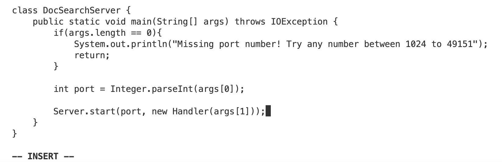

# Lab Report 4
## Part 1
The task I picked:
Changing the main method to take a command-line argument


```
/tec<enter>n<left arrow key><left arrow key><left arrow key>d3wi<right arrow key>args[1]));<esc>:wq<enter>
```

I use /tec+enter to search for the tec key word in the file and the cursor moves to the first letter of the first tec it finds. 

Then I press n to find the next tec in the file which is the one I want to change.

Then I press the left arrow key three times to move the cursor to ".

Then I press d3w to delete the next three words from the current position of the cursor.

Then I press i+right arrow key to enter the insert mode and begins to insert texts.

I insert the desired agrs[1] into the file and also complete the syntax that were deleted before. 

I press esc to exit the insert mode and return to normal mode.

I press :wq+enter to save all the changes I made to the file and exit vim.

## Part 2
The first task took me 112 seconds to complete.The second task took me 77 seconds to complete. For the first task, it took me lots of time to copy the files to the remote computer. For the second task, I can't directly see the java file I want to edit, but I still can see its contents from vim, which turns out to be fine. 

I would prefer using the second method because it takes less time for me to edit the remote program. For the first task, I not only have to copy files to the remote computer, but also have to login to the remote computer and run the program there. However, for the second task, I can just login to the remote computer in the first place and directly edit and run the program there using vim. 

If the prpject is something I am sure I need to do a lot small changes over time, then I would prefer the second style. If I need to make lots of small changes to this program, it is very inconvenient to copy the files to the remote server so many times. Even though we can only edit file through vim from the remote server, it is not hard to use vim for small changes so the second style is the ideal one in this case. On the contrary, if a big change needs to be done to a program, it may be much easier to edit it from the local computer because I can directly view the file and edit the file in whichever software I am most comfortable with in order to maximize efficiency. 