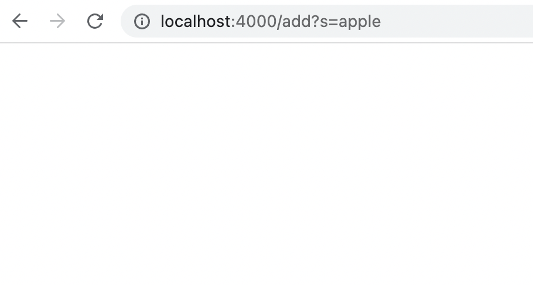
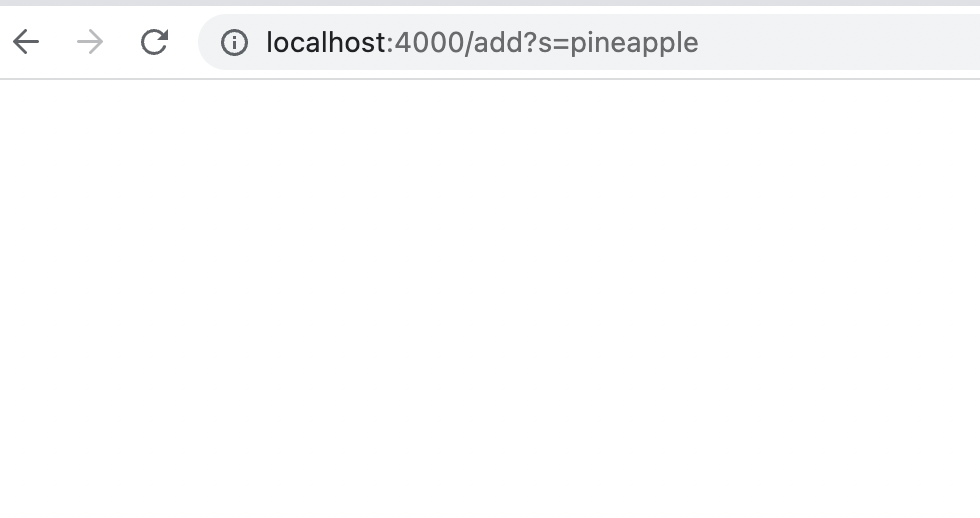
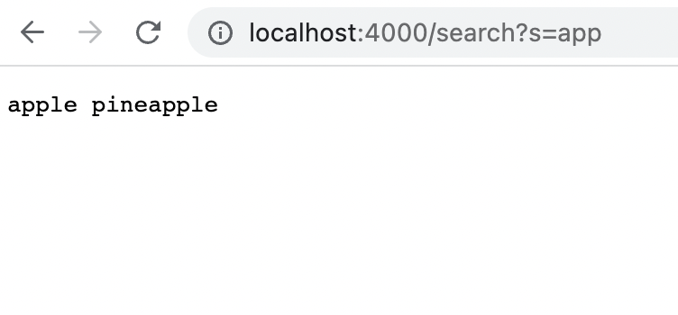
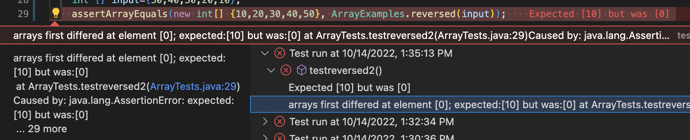
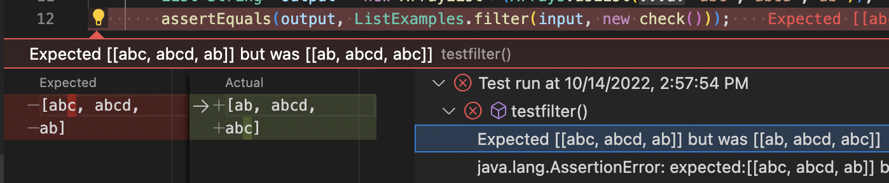

# Lab Report 2

Part 1
```
import java.net.URI;
import java.util.ArrayList;
import java.io.IOException;
class Handler implements URLHandler{
    ArrayList<String> str = new ArrayList<String>();
    public String handleRequest(URI url){
        if (url.getPath().equals("/")) {
            return "";}
        if (url.getPath().contains("/add")){
            String[] parameter = url.getQuery().split("=");
            if (parameter[0].equals("s")){
                str.add(parameter[1]);
                return "";
            }
        }
        if (url.getPath().contains("/search")){
            String[] parameter = url.getQuery().split("=");
            if (parameter[0].equals("s")){
                ArrayList<String> result = new ArrayList<String>();
                for (int i=0; i<str.size(); i++){
                    if (str.get(i).contains(parameter[1])){
                        result.add(str.get(i));
                    }
                }
                String output="";
                for (int i=0; i<result.size(); i++){
                    output=output+result.get(i)+" ";
                }
                return output;
            }
        }
        return "404 not found";
    }
    
}
class SearchEngine {
    public static void main(String[] args) throws IOException {
        if(args.length == 0){
            System.out.println("Missing port number! Try any number between 1024 to 49151");
            return;
        }

        int port = Integer.parseInt(args[0]);

        Server.start(port, new Handler());
    }
}

```
>First screenshot


* HandleRequest method is called.

* The input url is localhost:4000/add?s=apple

* The class field str is an empty arraylist.

* String[] parameter = [s,apple]

* parameter[0]=s

* parameter[1]=apple

* By the time the request is done processing, str changes from an empty arraylist to an arraylist containing apple.

>Second screenshot


* HandleRequest method is called.

* The input url is localhost:4000/add?s=pineapple

* The class field str is an arraylist containing apple.

* String[] parameter = [s,pineapple]

* parameter[0]=s

* parameter[1]=pineapple

* By the time the request is done processing, str changes from an arraylist containing apple to an arraylist containing apple and pineapple.

> Third screenshot


* HandleRequest method is called.

* The input url is localhost:4000/search?s=app

* String[] parameter=[s,app]

* parameter[0]=s

* parameter[1]=app

* The value of result changes from an empty arraylist to an arraylist containing apple and pineapple.

* The string output changes from an empty string to a string with value apple pineapple.

* The class field is an arraylist containing apple and pineapple.

Part 2
>First bug

reversed method in ArrayExamples.java

The failure inducing input is:
```
@Test
  public void testreversed2(){
    int [] input={50,40,30,20,10};
    assertArrayEquals(new int[] {10,20,30,40,50}, ArrayExamples.reversed(input));
  }
}
```
The symptom is:




The bug of the code is that the method does not return the new array it creates but instead returns the input array. So the for loop is basically just assigning values of zero to all of the input array's elements since the new empty array contains only zero as its elements. 

So the fixed code should be:
```
  static int[] reversed(int[] arr) {
    int[] newArray = new int[arr.length];
    for(int i = 0; i < arr.length; i += 1) {
      if (i<=arr.length/2){
      newArray[i]=arr[arr.length-i-1];}
      newArray[arr.length-i-1]=arr[i];
    }
    if (arr.length%2==1){
      newArray[arr.length/2]=arr[arr.length/2];
    }
    return newArray;
  }
  ```
The expected output of the first element should be 10, which is the last element of the input array. However, it turns out to be zero. When the line of code arr[i] = newArray[arr.length - i - 1] is called on the first element of the input array, it assigns the value of newArray[4] to the first element of the input array. The value of newArray[4] is zero because newArray is an empty array. Then the input array is returned at last which results in the output of the first element to be zero. 


> Second bug

filter method in ListExamples.java

The failure inducing input is:
```
class check implements StringChecker{
  public boolean checkString(String s){
      if (s.length()>1 && s.length()<5){
          return true;
      }
      else{
          return false;
      }
  }
}
public class ListTest {
    @Test
    public void testfilter(){
        List<String> input = new ArrayList<>(Arrays.asList("a","abc","abcd","abcde","ab"));
        List<String> output = new ArrayList<>(Arrays.asList("abc","abcd","ab"));
        assertEquals(output, ListExamples.filter(input, new check()));
    }
    
}
```
The symptom is:



The bug of the code is that although it can correctly filter the strings that passes stringchecker, the order of the strings it returns is opposite as it should be. This is because the method is prepending to the new arraylist. 

So the fixed code should be:
```
  static List<String> filter(List<String> list, StringChecker sc) {
    List<String> result = new ArrayList<>();
    for(String s: list) {
      if(sc.checkString(s)) {
        result.add(s);
      }
    }
    return result;
  }
  ```
  The expected output of the test should be [abc,abcd,ab] but instead is [ab,abcd,abc]. The order of the element is to the opposite of the right order. This is because the line of code result.add(0,s) constantly prepends the string that passes string checker to the new list, while the loop is iterating from the front of the input list to the end. 

  