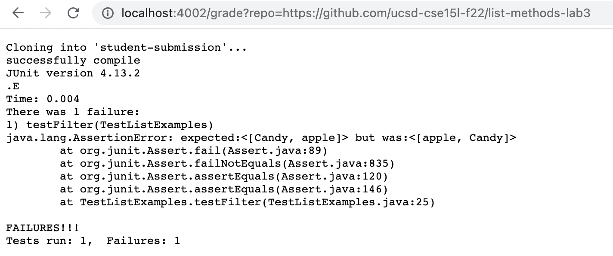
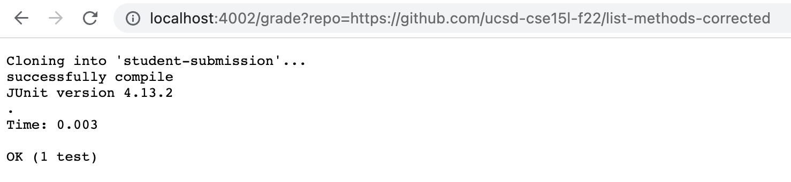
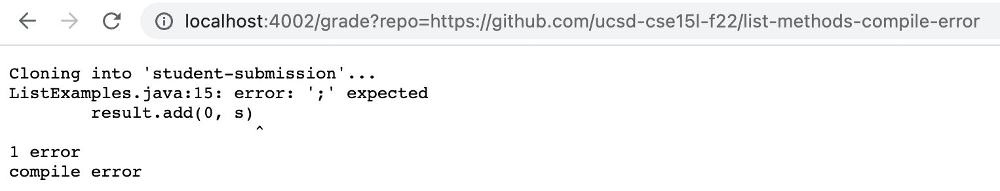

# Lab Report 5
```
set -e

rm -rf student-submission
git clone $1 student-submission

if [[ ! -f "student-submission/ListExamples.java" ]]
then
    echo "wrong files submitted"
    exit
fi

rm -rf autograder
mkdir autograder
cp TestListExamples.java autograder
cp student-submission/ListExamples.java autograder
cp lib/hamcrest-core-1.3.jar autograder
cp lib/junit-4.13.2.jar autograder

cd autograder
set +e
javac -cp .:hamcrest-core-1.3.jar:junit-4.13.2.jar *.java
if [[ $? -eq 0 ]]; then
    echo "successfully compile"
else
    echo "compile error"
    exit
fi

java -cp .:hamcrest-core-1.3.jar:junit-4.13.2.jar org.junit.runner.JUnitCore TestListExamples
```

First Repository:



Second Repository:



Third Repository:



## Trace of third repository:

```set -e```

The return code is zero.

```rm -rf student-submission```

The return code is zero.

```git clone $1 student-submission``` 

The return code is zero and the standard output is "Cloning into 'student-submission'...".

```
if [[ ! -f "student-submission/ListExamples.java" ]]
then
    echo "wrong files submitted"
    exit
fi
```
This code block does not run because the correct file is submitted.

```rm -rf autograder```

The return code is zero.

```mkdir autograder```

The return code is zero.

```cp TestListExamples.java autograder```

The return code is zero.

```cp student-submission/ListExamples.java autograder```

The return code is zero.

```cp lib/hamcrest-core-1.3.jar autograder```

The return code is zero.

```cp lib/junit-4.13.2.jar autograder```

The return code is zero.

```cd autograder```

The return code is zero.

```set +e```

The return code is zero

```javac -cp .:hamcrest-core-1.3.jar:junit-4.13.2.jar *.java```

The return code is non-zero and the standard error is: 
```
ListExamples.java:15: error: ';' expected
        result.add(0, s)
                        ^
1 error
```
```
if [[ $? -eq 0 ]]; then
    echo "successfully compile"
```
This code block does not run because the if statement evaluates to false.

```echo "compile error"```

The return code is zero and the standard output is "compile error".

```exit```

The return code is zero.

```java -cp .:hamcrest-core-1.3.jar:junit-4.13.2.jar org.junit.runner.JUnitCore TestListExamples```

This does not run because of an early exit due to compile error. 